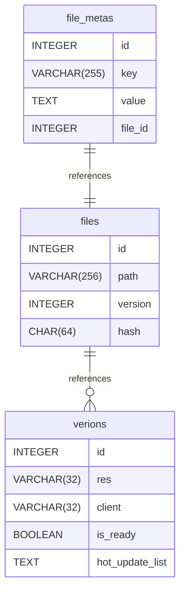

# Untitled Diagram documentation
## Summary

- [Introduction](#introduction)
- [Database Type](#database-type)
- [Table Structure](#table-structure)
	- [files](#files)
	- [verions](#verions)
	- [file_metas](#file_metas)
- [Relationships](#relationships)
- [Database Diagram](#database-Diagram)

## Introduction

## Database type

- **Database system:** PostgreSQL
## Table structure

### files

| Name        | Type          | Settings                      | References                    | Note                           |
|-------------|---------------|-------------------------------|-------------------------------|--------------------------------|
| **id** | INTEGER | 🔑 PK, not null , unique, autoincrement |  | |
| **path** | VARCHAR(256) | not null  |  | |
| **version** | INTEGER | not null  | files_version_fk | |
| **hash** | CHAR(64) | not null  |  |sha-256 | 

#### Indexes
| Name | Unique | Fields |
|------|--------|--------|
| files_index_0 | ✅ | path, version |
### verions

| Name        | Type          | Settings                      | References                    | Note                           |
|-------------|---------------|-------------------------------|-------------------------------|--------------------------------|
| **id** | INTEGER | 🔑 PK, not null , unique, autoincrement |  | |
| **res** | VARCHAR(32) | not null  |  |like 24-09-23-11-27-19-c6564b |
| **client** | VARCHAR(32) | not null  |  |like 2.3.61 |
| **is_ready** | BOOLEAN | not null  |  | |
| **hot_update_list** | TEXT | not null  |  | | 

### file_metas

| Name        | Type          | Settings                      | References                    | Note                           |
|-------------|---------------|-------------------------------|-------------------------------|--------------------------------|
| **id** | INTEGER | 🔑 PK, not null , unique, autoincrement |  | |
| **key** | VARCHAR(255) | not null  |  | |
| **value** | TEXT | not null  |  | |
| **file_id** | INTEGER | not null  | file_metas_file_id_fk | | 

#### Indexes
| Name | Unique | Fields |
|------|--------|--------|
| file_metas_index_0 | ✅ | key, value, file_id |
## Relationships

- **files to verions**: many_to_one
- **file_metas to files**: one_to_one

## Database Diagram

