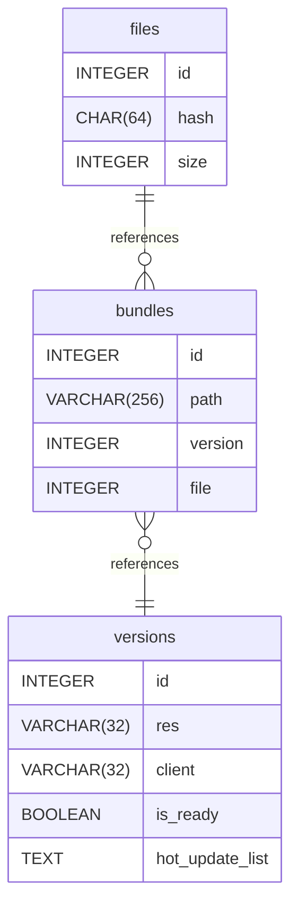

# Untitled Diagram documentation
## Summary

- [Introduction](#introduction)
- [Database Type](#database-type)
- [Table Structure](#table-structure)
	- [bundles](#bundles)
	- [versions](#versions)
	- [files](#files)
- [Relationships](#relationships)
- [Database Diagram](#database-diagram)

## Introduction

## Database type

- **Database system:** PostgreSQL
## Table structure

### bundles

| Name        | Type          | Settings                      | References                    | Note                           |
|-------------|---------------|-------------------------------|-------------------------------|--------------------------------|
| **id** | INTEGER | 🔑 PK, not null, unique, autoincrement |  | |
| **path** | VARCHAR(256) | not null |  | |
| **version** | INTEGER | not null | files_version_fk | |
| **file** | INTEGER | not null |  |sha-256 | 

#### Indexes
| Name | Unique | Fields |
|------|--------|--------|
| files_index_0 | ✅ | path, version |
### versions

| Name        | Type          | Settings                      | References                    | Note                           |
|-------------|---------------|-------------------------------|-------------------------------|--------------------------------|
| **id** | INTEGER | 🔑 PK, not null, unique, autoincrement |  | |
| **res** | VARCHAR(32) | not null |  |like 24-09-23-11-27-19-c6564b |
| **client** | VARCHAR(32) | not null |  |like 2.3.61 |
| **is_ready** | BOOLEAN | not null |  | |
| **hot_update_list** | TEXT | not null |  | | 

### files

| Name        | Type          | Settings                      | References                    | Note                           |
|-------------|---------------|-------------------------------|-------------------------------|--------------------------------|
| **id** | INTEGER | 🔑 PK, not null, unique, autoincrement | files_id_fk | |
| **hash** | CHAR(64) | not null, unique |  | |
| **size** | INTEGER | not null |  | | 

#### Indexes
| Name | Unique | Fields |
|------|--------|--------|
| file_metas_index_0 | ✅ | key, value, file_id |
## Relationships

- **bundles to versions**: many_to_one
- **files to bundles**: one_to_many

## Database Diagram

