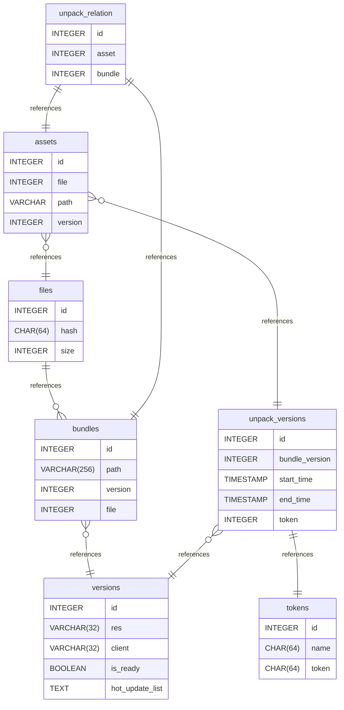

# Untitled Diagram documentation
## Summary

- [Introduction](#introduction)
- [Database Type](#database-type)
- [Table Structure](#table-structure)
	- [bundles](#bundles)
	- [versions](#versions)
	- [files](#files)
	- [assets](#assets)
	- [unpack_versions](#unpack_versions)
	- [unpack_relation](#unpack_relation)
	- [tokens](#tokens)
- [Relationships](#relationships)
- [Database Diagram](#database-Diagram)

## Introduction

## Database type

- **Database system:** PostgreSQL
## Table structure

### bundles

| Name        | Type          | Settings                      | References                    | Note                           |
|-------------|---------------|-------------------------------|-------------------------------|--------------------------------|
| **id** | INTEGER | 🔑 PK, not null , unique, autoincrement |  | |
| **path** | VARCHAR(256) | not null  |  | |
| **version** | INTEGER | not null  | files_version_fk | |
| **file** | INTEGER | not null  |  |sha-256 | 

#### Indexes
| Name | Unique | Fields |
|------|--------|--------|
| files_index_0 | ✅ | path, version |
### versions

| Name        | Type          | Settings                      | References                    | Note                           |
|-------------|---------------|-------------------------------|-------------------------------|--------------------------------|
| **id** | INTEGER | 🔑 PK, not null , unique, autoincrement |  | |
| **res** | VARCHAR(32) | not null  |  |like 24-09-23-11-27-19-c6564b |
| **client** | VARCHAR(32) | not null  |  |like 2.3.61 |
| **is_ready** | BOOLEAN | not null  |  | |
| **hot_update_list** | TEXT | not null  |  | | 

### files

| Name        | Type          | Settings                      | References                    | Note                           |
|-------------|---------------|-------------------------------|-------------------------------|--------------------------------|
| **id** | INTEGER | 🔑 PK, not null , unique, autoincrement | files_id_fk | |
| **hash** | CHAR(64) | not null , unique |  | |
| **size** | INTEGER | not null  |  | | 

#### Indexes
| Name | Unique | Fields |
|------|--------|--------|
| file_metas_index_0 | ✅ | key, value, file_id |
### assets

| Name        | Type          | Settings                      | References                    | Note                           |
|-------------|---------------|-------------------------------|-------------------------------|--------------------------------|
| **id** | INTEGER | 🔑 PK, not null , unique, autoincrement |  | |
| **file** | INTEGER | not null  | assets_file_fk | |
| **path** | VARCHAR | not null  |  | |
| **version** | INTEGER | not null  | assets_version_fk | | 

### unpack_versions

| Name        | Type          | Settings                      | References                    | Note                           |
|-------------|---------------|-------------------------------|-------------------------------|--------------------------------|
| **id** | INTEGER | 🔑 PK, not null , unique, autoincrement |  | |
| **bundle_version** | INTEGER | not null  | unpack_version_version_fk | |
| **start_time** | TIMESTAMP | not null , default: CURRENT_TIMESTAMP |  | |
| **end_time** | TIMESTAMP |  |  | |
| **token** | INTEGER | not null  | fk_unpack_version_token_tokens | | 

### unpack_relation

| Name        | Type          | Settings                      | References                    | Note                           |
|-------------|---------------|-------------------------------|-------------------------------|--------------------------------|
| **id** | INTEGER | 🔑 PK, not null , unique, autoincrement |  | |
| **asset** | INTEGER | not null  | unpack_relation_asset_fk | |
| **bundle** | INTEGER | not null  | unpack_relation_bundle_fk | | 

#### Indexes
| Name | Unique | Fields |
|------|--------|--------|
| unpack_relation_index_0 | ✅ | asset, bundle |
### tokens

| Name        | Type          | Settings                      | References                    | Note                           |
|-------------|---------------|-------------------------------|-------------------------------|--------------------------------|
| **id** | INTEGER | 🔑 PK, not null , unique, autoincrement |  | |
| **name** | CHAR(64) | not null  |  | |
| **token** | CHAR(64) | not null  |  |64长的hex | 

## Relationships

- **bundles to versions**: many_to_one
- **files to bundles**: one_to_many
- **assets to files**: many_to_one
- **unpack_versions to versions**: many_to_one
- **assets to unpack_versions**: many_to_one
- **unpack_relation to assets**: one_to_one
- **unpack_relation to bundles**: one_to_one
- **unpack_versions to tokens**: one_to_one

## Database Diagram

